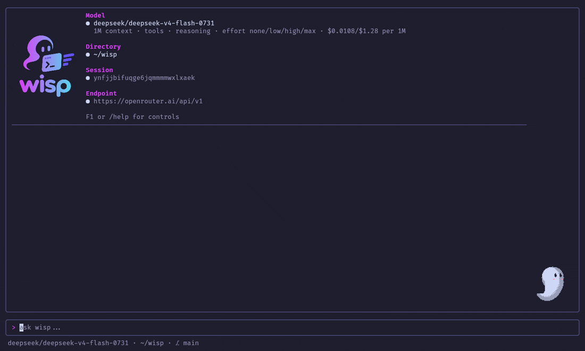
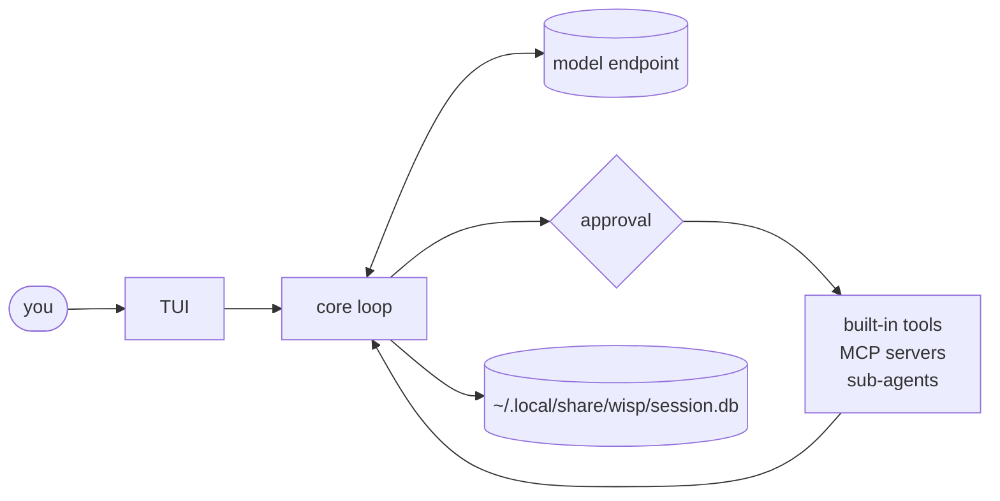

<p align="center">
  
</p>

<p align="center">
  <b>A small, fast agent for your terminal, built for local models.</b>
</p>

<p align="center">
  <a href="https://github.com/antoniosarro/wisp/releases/latest"></a>
  <a href="LICENSE"></a>
  
</p>

wisp is a general-purpose agent harness: it gives a model tools to read,
search, and change files, run commands, and fetch from the web, asks before
anything risky, and keeps every session. Software work is one use among
many; an `AGENTS.md` in a project can specialize it. It talks to any
OpenAI-compatible endpoint (llama.cpp, vLLM, Ollama, LM Studio, or
OpenRouter) and is tuned for the small context windows and single-slot
servers that local models run on. It is one static Go binary with a small
core and no framework around it.



## Features

- **Local-first.** Discovers each model's context window, tool support,
  vision, and reasoning from the server itself, and streams reasoning from
  models that show it.
- **Built-in tools.** `read`, `ls`, `glob`, `grep`, `write`, `edit`,
  `multi_edit`, `bash`, `fetch`, and a `todo` list. Reads run in parallel,
  and output is capped so one big file can't flood the context.
- **Approvals you can read.** Commands, diffs, and new files are shown
  before they run, with control characters made visible, and a write
  through a symlink names the file it lands in. Allow once, for the
  session, or deny with a note to the model.
- **Credentials stay put.** Reading SSH keys, cloud credentials, or `.env`
  files asks first, and searches skip them.
- **Long sessions on small windows.** Old tool output is masked and the
  conversation summarized as the window fills, with summaries prepared
  between turns so compaction costs no wait.
- **Resumable sessions.** Everything is saved as it happens in one SQLite
  database (`~/.local/share/wisp/session.db`), each session tagged with its
  directory, and interrupted turns are repaired on resume.
- **Sub-agents and MCP.** Delegate to agents with their own model and tools,
  and connect MCP servers without paying for their tool lists on every
  request. A cloned project's own servers and agents run only once you
  trust it.
- **Tracing.** `--trace` shows every turn, request, tool call, and cost as
  live timelines in the browser.
- **Cost-aware on OpenRouter.** Only zero-data-retention providers, the
  cheapest first, with the real billed cost per request.

## Install

**Nix** (flake):

```sh
nix run github:antoniosarro/wisp               # try it
nix profile install github:antoniosarro/wisp   # install it
```

The flake also has a NixOS module and a home-manager module that can set
the endpoint, model, API key file, MCP servers, and sub-agents
([packaging/README.md](packaging/README.md#nix-and-nixos)).

**Debian / Ubuntu, Arch:** download the package from the
[latest release](https://github.com/antoniosarro/wisp/releases/latest):

```sh
sudo apt install ./wisp_*_amd64.deb
sudo pacman -U wisp-*-x86_64.pkg.tar.zst
```

**From source** (Go 1.26.7 or newer):

```sh
go install github.com/antoniosarro/wisp/cmd/wisp@latest
```

Linux is the supported platform. wisp builds for macOS but isn't tested
there yet.

## Quick start

Point wisp at a model server and run it in your project:

```sh
cd your-project
wisp --base-url http://localhost:8080/v1          # llama.cpp, vLLM, LM Studio, ...
wisp --base-url http://localhost:11434/v1         # Ollama
```

For a hosted API, set a key and pick a model:

```sh
export WISP_BASE_URL=https://openrouter.ai/api/v1
export WISP_API_KEY=sk-or-...
wisp --model z-ai/glm-5.3-flash
```

Without `--model`, wisp uses the last model you used with that endpoint, or
the only one it serves, or lets you pick. The same variables and flags work
for one-shot runs:

```sh
wisp "Explain this repository"     # one turn, then exit
wisp --sessions                    # list this directory's sessions
wisp --resume 3f2a                 # continue one
```

Add an `AGENTS.md` to your project with anything the model should know; it
goes into every request.

## How it works



Each turn, the loop sends the conversation to the model, runs the tool
calls it asks for (asking you first when they're risky), feeds the results
back, and repeats until the model answers. Before every request it checks
the context budget and masks or summarizes old history if needed.
Everything is saved as it happens. See [architecture](docs/architecture.md).

## Using it

| Key | Action |
| --- | --- |
| Enter / Alt+Enter | Send / new line |
| Esc | Cancel the running turn |
| Up / Down | Recall earlier prompts |
| Alt+Left / Alt+Right, Ctrl+O | Select a block, expand it |
| Ctrl+Y | Copy the selected block |
| F1 | All keys and commands |

Commands: `/model` switches models, `/resume` and `/sessions` switch
sessions, `/compact` summarizes on request, `/context` and `/debug` show
where the context and the money go, `/clear` starts over. Approvals take
`y` (allow), `a` (always allow calls like it), `n` (deny), and `t` (deny
with a note). The full guide is in [docs/usage.md](docs/usage.md).

## Configuration

wisp is configured with flags and environment variables; there's no config
file.

| Variable | Flag | |
| --- | --- | --- |
| `WISP_BASE_URL` | `--base-url` | OpenAI-compatible endpoint |
| `WISP_API_KEY` | `--api-key` | API key, when the endpoint needs one |
| `WISP_MODEL` | `--model` | Model to use |
| `WISP_THEME=light` | | Light palette |

MCP servers go in `~/.config/wisp/mcp.json` or `.wisp/mcp.json`, sub-agents
in `~/.config/wisp/agents/` or `.wisp/agents/`. A cloned project's `.wisp/`
config is used only after you trust it. Everything else, from pricing to
OpenRouter routing, is in [docs/config.md](docs/config.md).

**Safety:** approval is not a sandbox. Tools run with your account's
access, so review what you allow, and run
`--dangerously-skip-permissions` only in a container or VM.

## Documentation

- [Using wisp](docs/usage.md) · [Configuration](docs/config.md) ·
  [Tools](docs/tools.md) · [Permissions](docs/permissions.md)
- [Sub-agents](docs/subagents.md) · [MCP servers](docs/mcp.md) ·
  [Tracing](docs/tracing.md)
- How it works: [Architecture](docs/architecture.md) ·
  [Model provider](docs/model-provider.md) ·
  [Context compaction](docs/compaction.md) · [Sessions](docs/session.md)

## Roadmap

- Config files (TOML, global and per project), including approval rules
  that persist across sessions
- Lua plugins for custom tools and hooks
- macOS and Windows builds

## Development

```sh
nix develop            # or: direnv allow; Go, just, and the QA tools
just build             # bin/wisp
just test              # unit tests; also: just race, just e2e, just snapshots
just check             # fmt, vet, lint, test
```

The end-to-end tests run the real binary against a scriptable fake model
server (`internal/cli/testdata/script/*.txtar`) and in a pseudo-terminal,
and TUI snapshots cover eighteen states at four terminal sizes.
`just screenshot` records the real TUI for the docs
([scripts/screenshot.sh](scripts/screenshot.sh)). Releases are tagged with
`just release` ([packaging/README.md](packaging/README.md)).

## License

[MIT](LICENSE) © Antonio Sarro
