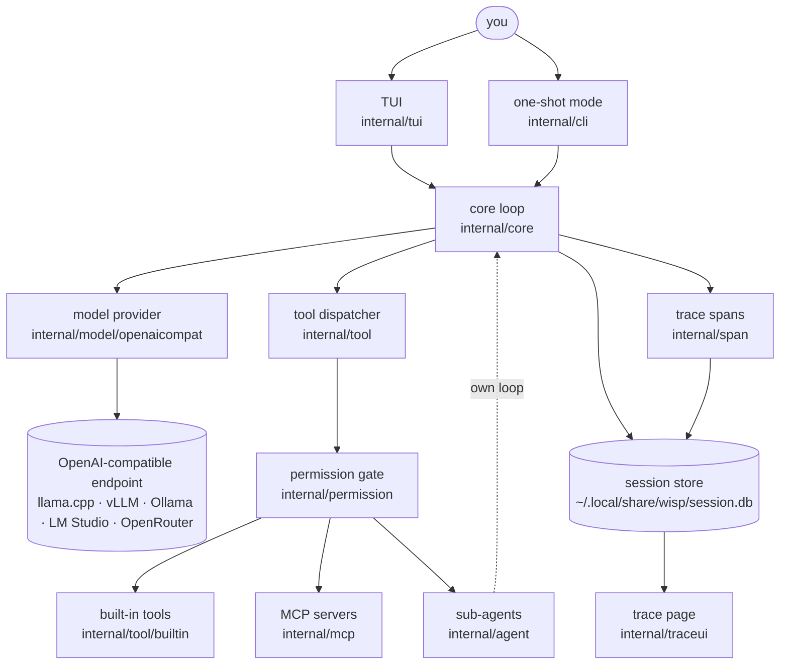
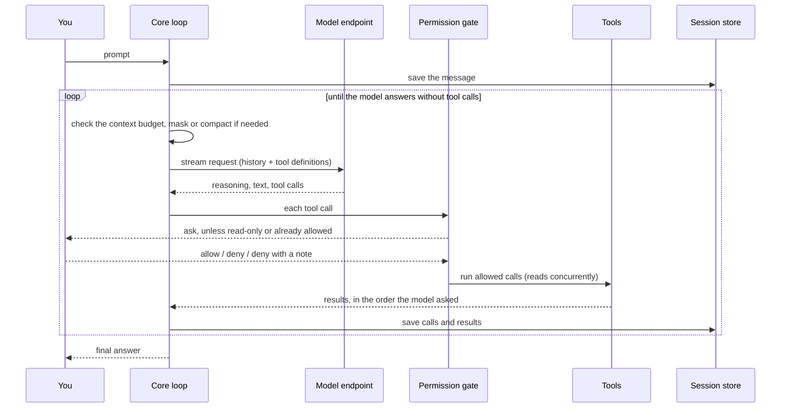

# Architecture

wisp is a loop that talks to a model, lets it call tools, and shows what
happens. Each part is a small package behind a plain Go interface; there is
no framework around them.

## Packages

| Package | Role |
| --- | --- |
| `cmd/wisp` | The `main` package: just calls `internal/cli` |
| `internal/cli` | Flags, setup, file locations and state, the one-shot mode, project trust, the update check; its end-to-end scenarios are in `testdata/script` |
| `internal/core` | The loop: stream a response, dispatch tool calls, feed results back, repeat until a plain answer. Also the context budget, masking, and compaction ([compaction.md](compaction.md)), and tracing the loop |
| `internal/model` | The provider contract (`Provider`, `Catalog`, `Info`, `Pricing`) |
| `internal/model/openaicompat` | The OpenAI-compatible client: streaming, reasoning, retries, model discovery ([model-provider.md](model-provider.md)) |
| `internal/tool` | The `Tool` interface, registry, concurrent dispatch, and the output budget ([tools.md](tools.md)) |
| `internal/tool/builtin` | read, ls, glob, grep, todo, write, edit, multi_edit, bash, fetch, web_search |
| `internal/credential` | Which paths hold credentials, for the tools and the permission rules ([permissions.md](permissions.md#credentials)) |
| `internal/permission` | Approval prompts and session "always allow" rules ([permissions.md](permissions.md)) |
| `internal/agent` | Sub-agents: separate loops behind the `agent` tool ([subagents.md](subagents.md)) |
| `internal/mcp` | MCP clients, `tool_search`, and the `mcp_call` proxy ([mcp.md](mcp.md)) |
| `internal/prompt` | The system prompt: persona, tool and safety rules, environment, `AGENTS.md` |
| `internal/session` | SQLite history, compactions, and spans ([session.md](session.md)) |
| `internal/span` | Timed, nested spans for tracing ([tracing.md](tracing.md)) |
| `internal/traceui` | The `--trace` web page |
| `internal/tui` | The Bubble Tea frontend: the transcript, approvals, commands and pickers, side panels, sub-agent chats, the mouse, and the logo and mascot; its screen snapshots are in `testdata/TestSnapshots` ([usage.md](usage.md)) |
| `internal/termsafe` | Strips escape sequences from model, tool, and endpoint text before it reaches the terminal |
| `internal/tokencount` | Local token estimates (cl100k), calibrated against what the endpoint reports |
| `internal/textfmt` | Cutting text to a size without splitting characters, and byte sizes |
| `internal/version` | wisp's version, set at link time, and its HTTP User-Agent |
| `assets` | Files embedded in the binary: the logo and the mascot's sprite strips, with their Aseprite source (`just sprites` exports them) |
| `internal/testutil` | Fakes for tests: a scripted provider, and (`fakemodel`) a scriptable OpenAI-compatible server for the end-to-end scenarios |

The core loop knows nothing about the terminal, and the TUI holds no agent
logic: it renders what the loop reports and forwards input. The one-shot
mode drives the same loop with a plain-text renderer.

## One turn

- **Concurrency.** Read-only calls run concurrently. A write or command is
  a barrier: it waits for the calls before it and holds back those after,
  so changes apply in the order the model asked for them.
- **Reasoning** is shown, traced, and counted, but not saved in the
  history or sent back.
- **Repeating steps.** A step with exactly the calls of the one before
  gets a note; a third in a row ends the turn
  ([tools.md](tools.md#dispatch)).
- **Repeating responses.** A response whose reasoning says the same
  sentence 8 times (`repeat.go`; lines of code, sentences under 20
  characters, and ones not starting with a capital letter don't count) is stopped mid-stream, as models stuck that way
  announce an action again and again without making the call until the
  output limit. Its text and calls are dropped, and a reminder quoting the
  sentence tells the model to act, as after a response cut off at the limit.
- **The step limit.** After 100 round trips without a final answer
  (`--max-iterations`), the model is asked for a summary of its progress
  without tools, and that ends the turn.
- **Tracing.** Every step is also recorded as a span, so `--trace` can
  show it live.

## Design choices

- **One wire format.** wisp speaks only OpenAI-compatible chat
  completions. Every local server and most hosted APIs do, so one client
  covers llama.cpp, vLLM, Ollama, LM Studio, and OpenRouter. What differs
  between them, such as how reasoning streams, where the context size is
  reported, or OpenRouter's routing, stays inside `openaicompat`, behind the
  `Provider` interface ([model-provider.md](model-provider.md)).
- **Small windows are the normal case.** A local model often has a small
  context window and a server with one slot. So tool output is capped, old
  output is masked before anything is summarized, and the summary is
  prepared while the server would sit idle ([compaction.md](compaction.md)).
- **The prompt cache is worth protecting.** On local hardware, re-reading a
  long prompt is the slow part of a request. wisp keeps the prompt's prefix
  stable: the tool list never changes during a session, and MCP tools are
  reached through two fixed tools instead. Changing the list measured at 0%
  cached; keeping it fixed, 93–98% ([mcp.md](mcp.md#a-fixed-tool-list-for-the-prompt-cache)).
- **Learn from the server, override with flags.** The context window,
  tool, vision, and reasoning support, and the reasoning effort levels come
  from the endpoint itself. Flags correct what it gets wrong; there is no
  config file yet ([config.md](config.md)).
- **Ask, don't sandbox.** Approvals show exactly what will run, with
  control characters made visible and symlinks resolved, and remember
  what you allow for the session. They are not a sandbox: tools run with
  your account's access ([permissions.md](permissions.md)).
- **Everything in one SQLite file.** Messages, compactions, and trace spans
  are written as they happen. That is what lets a crashed turn be repaired
  on resume, several wisp processes share a directory, and the trace page
  show a session live ([session.md](session.md)).
- **Sub-agents return reports, not transcripts.** A sub-agent works in its
  own loop, and only its final message reaches the main conversation, so
  delegating keeps the main context small. There is one level: sub-agents
  can't start their own ([subagents.md](subagents.md)).
- **Observable by default.** Every turn, request, and tool call is a span
  in the session database, so tracing costs nothing to turn on and works
  for past sessions too ([tracing.md](tracing.md)).
- **A small core, no framework.** Each part is a package behind a plain Go
  interface, built into one static binary.

## Scope

- **Local-first, not a server.** wisp runs where you work, against a local
  or remote model API.
- **Linux first.** The code is portable Go, but only Linux is tested;
  process-group cancellation of shell commands is Linux-specific.
