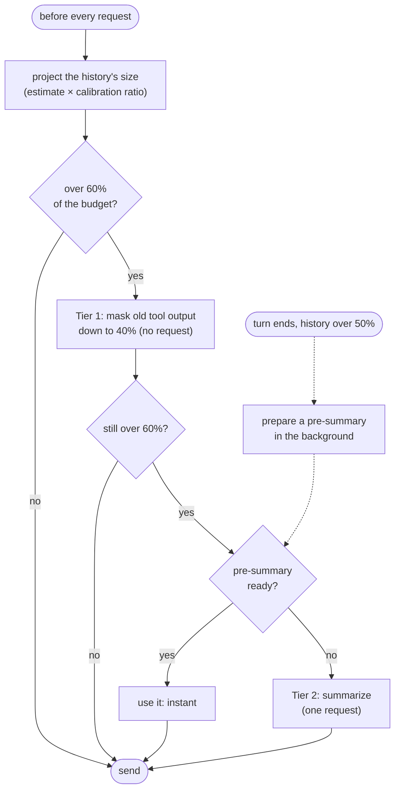

# Context compaction

Local models often run with small windows (16K–128K). Compaction keeps long
sessions working in them while losing as little as possible of what the
model needs to continue. The code is in `internal/core`:

| File | Part |
| --- | --- |
| `budget.go` | Counting tokens, calibrating, the budget, clipping results |
| `mask.go`, `stub.go`, `spill.go` | Tier 1: masking old tool output, the stand-ins, saved output |
| `ledger.go` | The facts recorded from the history |
| `compact.go`, `summary.go` | Tier 2: where to cut, and the summary request |
| `presummary.go` | Preparing the next summary between turns, re-attaching files |



In short: old tool output is replaced with stand-ins that say how to get it
back (tier 1). When that isn't enough, the older part of the conversation
is summarized and the recent part kept verbatim (tier 2). With a local
model, summaries are usually prepared between turns, while the GPU is
idle, so compacting costs no wait. `/compact [focus]` compacts on request,
and `--no-summarize` only masks.

## Goal

Keep what the model needs to continue:

- the user's goal, instructions, constraints, and corrections;
- decisions made and why;
- what changed in which files, and what was learned from reading them;
- errors hit, their causes, and their fixes, so they aren't repeated;
- the current state and the next step.

It must be **fast**: no request in the common case, at most one request
per compaction, a warm prefix cache, and the slow part (generating a
summary) hidden in time the GPU would otherwise sit idle. And it must be
**honest**: the model knows what was dropped and exactly how to get it
back.

## Principles

1. **Mask first, summarize rarely.** Old tool output dominates an agent's
   context, and masking it costs no request.
2. **Keep failure signals.** Stand-ins keep exit codes and error lines; the
   summary has an "errors and fixes" section.
3. **Keep the user's words verbatim**, up to a budget.
4. **Record facts deterministically; let the model write only judgment.**
   Files changed, files read, commands and exit codes, the todo list, and
   user messages come from the history, not from the model's memory. That
   is more reliable, and shortens the summary, which is the only slow part.
5. **Summarize over the cached prefix.** The summary request is the current
   history plus one appended message, so prefill is a cache hit and only
   generation costs.
6. **Change history rarely, in large steps.** Any edit to a message discards
   the cache from that message on. Every change must free a worthwhile
   amount and drop well below the trigger.
7. **Do slow work when the GPU is idle.** Generate the summary between
   turns, while the user reads and types.
8. **Every stand-in says how to recover the content, safely.**
9. **Never fail the session.** If the summary request fails, compaction
   still succeeds with the recorded facts alone.

## Budget

### Counting

- **Per message:** `Content` (or its stand-in), every tool call's name and
  arguments (or their elided form), images at a fixed cost each, and a few
  tokens of chat-template overhead. The system prompt counts as a message
  too.
- **Incrementally.** The loop keeps one running total: messages appended
  since the last count are added to it, and masking, a compaction, or a
  dropped image resets it so the next call recounts.
- **Calibrated.** After each request, `ratio = reported prompt tokens /
  estimated prompt tokens`, smoothed (α = 0.3) and clamped to [0.7, 1.5].
  Every estimate is multiplied by it. Without reported usage it stays 1.
  The local tokenizer is cl100k, which differs from most local models' by
  10–25%.
- **Projected before every request**, not after: the whole history as the
  next request would send it. All triggers compare that projection, so an
  overflow is caught before it is sent.

### Thresholds

The fixed cost, system prompt plus tool definitions, can't be compressed,
so thresholds apply to what is left:

```
reserve = min(clamp(window/8, 4K, 16K), model max output)   room for the answer
budget  = window − reserve − fixed                           what history may use
```

Each turn's request asks for at most what is left of the window after the
prompt, less 5% for the estimate's error, but never less than the reserve
and never more than 32K or the model's max output. That `max_tokens`
keeps a backend that counts prompt plus cap against the window (vLLM) from
refusing the request, and OpenRouter from holding credit for the model's
whole output limit, which a key with a lower spending limit can't cover.

| Parameter | Default | Meaning |
| --- | --- | --- |
| mask trigger | history > 60% of budget | start tier 1 |
| mask target | 40% of budget | tier 1 masks down to here in one batch |
| clear at least | `max(2K, 10% of budget)` | tier 1 doesn't run for less; the cache break isn't worth it |
| summarize trigger | history still > 60% of budget after tier 1 has run | start tier 2 |
| least summarized | 2 × summary cap | tier 2 doesn't run when less than this precedes the cut |
| protected window | last 10 steps, at most 30% of budget, but always the last 3 | tool results tier 1 leaves alone |
| kept tail | `min(20K, 25% of budget)` | messages kept verbatim by tier 2 |
| summary cap | `clamp(8% of budget, 1K, 3K)` | `max_tokens` of the summary request |
| pre-summarize | history > 50% of budget at turn end | start tier 2's request in the background |

**An unknown window.** Only the reactive path runs. When the endpoint
rejects a request as too long, wisp reads the window from the error when
the server states it (vLLM, llama.cpp, and OpenAI-style errors do), keeps
it for the session, and uses the proactive path from then on.

**After a rejection,** the loop retries after masking to the target, then
after masking everything it can, then after summarizing. Only when none of
those changes anything does the turn fail, saying the conversation no
longer fits.

## Tier 0: result caps that scale with the window

Tools cap their own output for large windows. On top of that, one result
may use at most 25% of the budget. On a 16K window that turns `read`'s
50 KB cap into about 10 KB; on 128K windows nothing changes.

- The loop applies the cap to every result after the tool returns, keeping
  the head and tail and saving the whole to a file, so it covers MCP and
  sub-agent results too, without tools knowing about the window.
- The cap is never below 256 tokens: when the fixed cost nearly fills the
  window the budget rounds to nothing, and that is when clipping matters
  most.

## Tier 1: masking (no request)

### What is masked

- **Tool results** outside the protected window, 500 bytes or larger.
- **Large tool-call arguments** outside the protected window: `write`'s
  `content`, `edit`'s and `multi_edit`'s old and new strings. The call
  keeps its name, path, and small arguments. Strings of 200 bytes or more
  become `"<masked: 212 lines, 7.9 KB; read the file for its current
  content>"`.
- **Never:** user messages, assistant text, results the model hasn't acted
  on yet (after the latest assistant message), and the latest todo result.

### Order

Within what may be masked, oldest first within each class, until the
target is reached:

1. **Superseded results,** which cost nothing to lose:
   - a read of a file later changed by a call that succeeded, or read
     again over the same lines;
   - any call run again with the same arguments;
   - any todo list but the latest.
2. **Tool-call arguments** of `write` and `edit`: the file is on disk.
3. **Everything else,** oldest first.

The whole batch is applied at once, and only if it frees at least the
"clear at least" amount: one cache break per batch.

### Stand-ins

Each stand-in names the call, keeps the signal, and gives a safe way back:

```
[read internal/core/loop.go lines 1-270: 11.2 KB masked; call read again to see it]
[grep "Dispatch": 12 matches in 4 files, 1.1 KB masked; call grep again to see it]
[bash "go test ./...": exit 1, 3.4 KB masked; full output in ~/.cache/wisp/masked/3f2a….txt
first error: loop_test.go:146: expected an error
last line: FAIL github.com/antoniosarro/wisp/internal/core 0.412s]
[read a.go: 2.9 KB masked; a later call superseded it]
```

- **Idempotent calls** (read, grep, glob, ls) say to run the call again:
  that is cheap and returns the current state, which is what the model
  wants anyway.
- **Everything else** (bash, fetch, agent, MCP tools) is saved to a file
  when masked, and the stand-in names it. The model reads or greps it with
  the tools it already has: no new tool, no tool-definition tokens.
  - The files are in `$XDG_CACHE_HOME/wisp/masked` (`~/.cache/wisp/masked`),
    only the user can read them, and each is named by a hash of its
    content. They are kept out of the shared temp directory, where another
    user could plant a file under a name wisp would use.
  - Files older than 7 days are pruned at the start of the first turn of a
    run. The store still holds the full content, so the same pass writes
    back any file the session still names.
- **Superseded output** says so, instead of giving a way back: the later
  call's output is the one to use.
- **Failures keep their signal:** for a failed call or a nonzero exit, the
  first line that looks like an error (`error`, `FAIL`, `panic`, a
  `file:line:` prefix, ...) and the last meaningful line, each cut to 200
  bytes.

### Sub-agents

A sub-agent's loop gets its model's context window, output cap, and price:
the main model's, or for an agent with its own model or endpoint, what
that endpoint reports, looked up once. So it clips results, masks, and,
when the window is known, summarizes with its own model. It doesn't
pre-summarize between turns; its final report already summarizes its work.

## Tier 2: summarizing (one request, usually precomputed)

Runs when tier 1 can't bring history back under the mask trigger, after a
rejection that masking didn't fix, or on `/compact [focus]`. Masking any
further would hide what the model has just read, and it would read it
again: in a 32K window that loop once filled a whole 45-minute run.

### Where to cut

Walk back from the end, adding up tokens, until the kept tail is reached,
then move the cut to the nearest earlier user message. If that keeps more
than twice the tail (the current turn is huge), cut at an assistant message
inside the turn instead, never between a tool call and its results. The
turn's user message is still carried verbatim in the ledger's user
messages, so the model never loses what it was asked to do.

### The request

- **Over the cached prefix.** The current history exactly as the next
  request would send it, plus one user message with the instruction
  (`prompt.Compact`). Tools stay in the request with `tool_choice: none`,
  so the prefix matches. `max_tokens` is the summary cap.
- **No reasoning.** The request asks for none, so thinking doesn't come out
  of the cap: `chat_template_kwargs` on llama.cpp, vLLM, and SGLang,
  `reasoning.enabled` on OpenRouter. Some endpoints reject that, and some
  models reason anyway until the cap cuts them off with no summary. Either
  way the request is sent once more with a cap of `max(4 × summary cap,
  8K)`, and, where the backend can bound it, reasoning limited to all but
  the summary's share. Whatever comes back is cut to the summary cap at a
  line boundary.
- **The instruction** says where the cut is, so the model doesn't spend
  tokens on the tail. It says which sections wisp appends itself, so the
  model doesn't repeat them, and passes any `/compact` focus.
- **Anchored and incremental.** On a later compaction the history already
  starts with the previous summary. The instruction asks for that summary
  *updated* with what happened since: keep every section and item still
  true, add new ones, mark resolved ones as resolved, and remove only what
  is contradicted. A cut inside a turn adds a "Current turn so far"
  section, in the same request.
- **Too long itself?** If the summary request is rejected as too long,
  everything that can be masked is, and it is retried once; if that fails
  too, the ledger alone stands in.
- **Counted like any request.** Its usage and cost count in the session's
  totals, a discarded pre-summary's included, and it is traced as a
  `compact` request.

### Sections the model writes

**Goal**, **Instructions and constraints**, **Progress**, **Decisions**
(with reasons and rejected alternatives), **Errors and fixes** (naming
failed approaches plainly, so they aren't retried), **Current state**,
**Next steps**, and **Critical context**: identifiers, values, and snippets
no file or command can give back.

### Sections wisp appends: the ledger

Facts taken from the history, not recalled by the model. The ledger is
stored with each compaction as JSON and carried forward by folding in the
messages after its cut, so it covers the whole session:

- `<files-modified>`: each path, its number of successful edits, and the
  exit status of the latest test or build command since the last edit
  (matched by name: `test`, `build`, `vet`, `make`, `pytest`, ...).
- `<files-read>`: files read and not changed since, with line ranges.
- `<commands>`: the last 20 bash commands with exit codes; repeats
  collapse into one line with their runs and failures.
- `<todo>`: the latest todo list.
- `<user-messages>`: every user message verbatim, each cut to 1 KB, oldest
  dropped first past `min(15% of budget, 8K)` tokens.

If the summary request fails or comes back empty, the ledger alone stands
in, with a line saying the narrative summary is missing. The session
continues.

### Re-attached files

After a compaction, the current content of up to 3 files is appended to the
summary, most recently modified first, within 10% of the budget, skipping
any file over half of that. It is what the next step most likely needs,
and reading from disk costs no request.

- Off below a 32K window: the budget is better spent on the tail.
- The files are read when the compaction is applied, numbered as `read`
  numbers lines, and stored with the compaction, so a resumed session
  sends the same prefix.

### What the model then sees

The system prompt (unchanged, so its cache survives), then the summary as a
user message marked `[wisp summary of the earlier conversation]`, then the
tail. If the tail starts with a user message, the summary is merged into
it, so user and assistant keep alternating for strict chat templates.

### Precomputing between turns

- **At turn end,** if the history is past the pre-summarize threshold and
  the endpoint is local (`model.Info.Local`), the summary request starts in
  the background. The backend's cache still holds the exact prefix, so
  prefill is free, and generation overlaps the user reading and typing.
  One-shot runs don't: they exit before it could be used.
- **Remote paid endpoints don't pre-summarize:** a summary that is never
  used is wasted money, not just wasted idle time.
- **When the next turn starts** while it is still generating, it is
  cancelled, since a single-slot server (llama.cpp's default) would queue
  the user's request behind it. The exception is a turn that will
  summarize at once anyway: it waits for it instead of starting over. A
  finished one is kept for a later turn.
- **It is used** while it was made against the current summary and the
  tail since its cut is at most twice the kept tail; otherwise a fresh
  summary is made. `/compact` with a focus always makes a fresh one.

### Storage

Nothing is deleted. `core.Loop.History` keeps every message, and each
compaction is a row in the `compactions` table ([session.md](session.md)):
the summary, the ledger, re-attached files, and `first_kept`, the index of
the first message kept verbatim. Requests send the latest summary in place
of `History[:first_kept]`. On resume, `Loop.LoadCompaction` restores it
once the window is known, since the summary is rendered for it.

## In the TUI

- **A notice** such as `Compacted context: 84K → 13K tokens (precomputed)`
  marks each compaction and expands to show the summary. On resume, every
  compaction of the session is marked. The transcript itself keeps
  everything.
- **A running compaction** shows a spinner, and Esc cancels it, leaving the
  context unchanged.
- **`/compact [focus]`** compacts on request, for example
  `/compact keep the API design details`.
- **`/debug` and `/context`** show the budget: the window, fixed cost, and
  history budget; history used, with the mask trigger; the
  calibration ratio; masked outputs and file bodies; the compaction count;
  and whether a pre-summary is generating or ready.
- **Context used** is one number wherever it appears (the status line's
  `ctx`, `/debug`'s "used", `/context`'s total): the fixed cost plus
  history, as the next request would send it, against the window. It is
  refreshed after every request and when a turn ends, so it includes the
  last reply. `/debug`'s budget bar is a different measure: history against
  its budget, which is how close masking and summarizing are.

## Design choices

1. **The summarizer is the same model.** It gets the cache hit; a separate
   model would cost a full prefill on another server.
2. **Tier 2 is automatic.** Precomputing makes it free in latency, and the
   ledger fallback makes it safe.
3. **The user-message budget shrinks with the window:** `min(15% of
   budget, 8K)`.
4. **No recall tool.** Saved files and the existing read and grep tools
   cover recovery without adding tool-definition tokens to every request.
