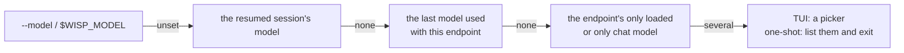

# Configuration

wisp has no config file: it is configured with flags and environment
variables, plus a few files for MCP servers, sub-agents, and project
instructions. `wisp -h` lists every flag. Put flags before the prompt.

## Endpoint and model

wisp talks to one OpenAI-compatible endpoint: `--base-url`, else
`$WISP_BASE_URL`, else `http://localhost:8000/v1`. It must stream chat
completions and support tool calling. wisp doesn't start a model server.

The model is picked in this order:

`/model` switches inside the TUI, and `--models` lists what the endpoint
offers with what it reports about each model.

### What wisp learns about a model

wisp asks the endpoint for the model's context window and capabilities,
from the `/models` listing and from local servers' native endpoints
([model-provider.md](model-provider.md#model-discovery)):

| Server | Context window | Tools | Vision | Reasoning |
| --- | --- | --- | --- | --- |
| vLLM, SGLang | `max_model_len` | n/a | n/a | n/a |
| llama.cpp | `/props` per-slot `n_ctx` | `/props` template caps | `/props` modalities | `/props` template |
| llama-swap | `meta.llamaswap.context_length` | the running model's `/props` | the running model's `/props` | the running model's `/props` |
| Ollama | `/api/ps` loaded context, else the model's `num_ctx` | `/api/show` | `/api/show` | `/api/show` |
| LM Studio | `/api/v0/models` loaded context | `tool_use` | model type `vlm` | n/a |
| OpenRouter | `context_length` | `supported_parameters` | input modalities | `supported_parameters`, `reasoning` |

- **The window** drives the context budget ([compaction.md](compaction.md))
  and the TUI's usage bar. Ollama and LM Studio report it only once a model
  is loaded, so the TUI asks again after the first turn.
- **The output cap** bounds each reply's `max_tokens` (32K at most). It comes
  from OpenRouter's `top_provider.max_completion_tokens` or, for
  llama-swap, a `max_completion_tokens` key in the model's `metadata`
  (next to `context_length`). llama-server's `--n-predict` isn't one: a
  request's `max_tokens` overrides it, so a cap meant for every client
  belongs in the metadata.
- **A model that can't call tools** runs without tools.
- **Vision** lets `read` send images (PNG, JPEG, GIF, WebP up to 10 MB).
- **Reasoning effort levels** are what `/effort` offers. A llama.cpp chat
  template that reads `reasoning_effort` takes `low`, `medium`, and
  `high`; one that reads `enable_thinking` takes `none`; any other takes
  none of them. llama-swap's model is asked once it is running: the TUI
  asks again after the first turn. Until levels are known, `/effort`
  lists only `default`; `/effort LEVEL` still sends any level. OpenRouter
  lists each model's `supported_efforts`, and `none` where reasoning
  isn't mandatory. Other hosted APIs don't report levels.
- **Overrides:** `--context-window N` and `--vision` replace what the
  endpoint reports.

## Flags

| Flag | Default | What it does |
| --- | --- | --- |
| `--base-url URL` | `$WISP_BASE_URL`, else `http://localhost:8000/v1` | The endpoint |
| `--api-key KEY` | `$WISP_API_KEY` | Sent as a bearer token; `--api-key ""` sends none |
| `--model NAME` | `$WISP_MODEL`, else [picked](#endpoint-and-model) | The model |
| `--models` | | List the endpoint's models and exit |
| `--context-window N` | what the endpoint reports | Override the context window |
| `--vision` | what the endpoint reports | Send image files to the model |
| `--effort LEVEL` | `$WISP_EFFORT`, else the model's own | Reasoning effort: `none`, `minimal`, `low`, `medium`, `high`, `xhigh`, or `max`; dropped for a model that doesn't take it |
| `--price IN,OUT[,CACHED_IN]` | `$WISP_PRICE`, else the endpoint's | Model price per million tokens, for [cost](#cost) |
| `--provider NAME` | `$WISP_PROVIDER` | OpenRouter: pin every request to one provider |
| `--cheapest` | | OpenRouter: route to the two cheapest zero-retention providers |
| `--notify MODE` | `$WISP_NOTIFY`, else `off` | In the TUI, notify when an approval waits or a long turn ends while the terminal isn't focused: `off`, `bell`, or `desktop` ([usage.md](usage.md#notifications)) |
| `--search-url URL` | `$WISP_SEARCH_URL` | Endpoint of the `web_search` tool: SearXNG, or Brave Search's API with `$WISP_SEARCH_KEY` ([tools.md](tools.md#searching-the-web-web_search)); without one there is no `web_search` |
| `--fetch-allow LIST` | `$WISP_FETCH_ALLOW` | Local IPs or CIDR prefixes `fetch` may reach, comma-separated ([tools.md](tools.md#the-web-fetch)) |
| `--resume ID` | | Continue a session ([session.md](session.md)) |
| `--sessions` | | List this directory's recent sessions and exit |
| `--suggest` | | Suggest a next message after each reply (one extra request, two for some reasoning models) |
| `--max-iterations N` | 100 | Model round trips per turn before wrapping up |
| `--max-agents N` | 1 | Sub-agents running at once ([subagents.md](subagents.md)) |
| `--no-summarize` | | Only mask old tool output; never summarize ([compaction.md](compaction.md)) |
| `--trust-project` | | Use this project's `.wisp/` config without asking ([permissions.md](permissions.md#project-trust)) |
| `--dangerously-skip-permissions` | | Skip approvals, except destructive MCP tools ([permissions.md](permissions.md#skipping-approvals)) |
| `--trace` | | Serve live session timelines while you work ([tracing.md](tracing.md)) |
| `--trace-only` | | Serve the timelines only; needs no model |
| `--trace-addr ADDR` | `127.0.0.1:7777` | Address for the trace page; a free port if taken |
| `--version` | | Print the version and exit |

## Environment variables

| Variable | Meaning |
| --- | --- |
| `WISP_BASE_URL`, `WISP_API_KEY`, `WISP_MODEL` | Defaults for `--base-url`, `--api-key`, `--model` |
| `WISP_PROVIDER`, `WISP_PRICE`, `WISP_EFFORT` | Defaults for `--provider`, `--price`, `--effort` |
| `WISP_FETCH_ALLOW` | Default for `--fetch-allow` |
| `WISP_NOTIFY` | Default for `--notify` |
| `WISP_SEARCH_URL`, `WISP_SEARCH_KEY` | Default for `--search-url`; Brave Search's key |
| `HTTP_PROXY`, `HTTPS_PROXY`, `NO_PROXY` | Proxy for `fetch` |
| `WISP_THEME=light` | Light palette; the default is dark |
| `WISP_LOGO=text` | Text logo on the splash, even on kitty and Ghostty |

`WISP_API_KEY` is removed from the environment of the commands and MCP
servers wisp starts. The key is never a flag default either, so `wisp -h`
can't print it.

## Files

| Path | What it holds |
| --- | --- |
| `AGENTS.md` | Project instructions, added to the system prompt (first 32 KB) |
| `~/.config/wisp/mcp.json`, `.wisp/mcp.json` | MCP servers, global and project ([mcp.md](mcp.md)) |
| `~/.config/wisp/agents/*.md`, `.wisp/agents/*.md` | Sub-agents, global and project ([subagents.md](subagents.md)) |
| `~/.local/share/wisp/session.db` | Every project's sessions and traces ([session.md](session.md)) |
| `~/.local/state/wisp/state.json` | The last model per endpoint, trusted projects, the update check |
| `~/.cache/wisp/masked/` | Masked command output, kept 7 days ([compaction.md](compaction.md#stand-ins)) |

- **Project config needs trust.** A project's `.wisp/mcp.json` and its
  agents' endpoints are used only once the project is trusted: wisp asks
  once in the terminal, and again when those files change
  ([permissions.md](permissions.md#project-trust)).
- **XDG.** `~/.config`, `~/.local/share`, `~/.local/state`, and `~/.cache`
  follow `$XDG_CONFIG_HOME`, `$XDG_DATA_HOME`, `$XDG_STATE_HOME`, and
  `$XDG_CACHE_HOME`.
- **Private.** The directories wisp creates are mode 700, and the files
  holding transcripts or output mode 600.

## Cost

`/debug`, the trace page, and one-shot runs' usage summary show what
requests cost:

- **OpenRouter:** the amount billed, at the rates of whichever provider
  served the request, cache discounts included.
- **Other hosted endpoints:** an estimate at the model's list price, with
  cached prompt tokens at the cached rate. When the endpoint doesn't report
  prices, pass `--price IN,OUT[,CACHED_IN]` in US dollars per million
  tokens, e.g. `--price 0.27,1.10,0.07`.
- **Local endpoints** (loopback, private ranges, Tailscale, `.local`/`.lan`
  names) have no API cost.

Sub-agents without a billed cost are priced at their model's rate;
`--suggest` requests aren't counted.

A suggestion asks the model not to reason (`chat_template_kwargs` on
llama.cpp-style servers, `reasoning.enabled` on OpenRouter), with room for
the message only. If the endpoint rejects that, or the model reasons
anyway without answering, wisp asks once more with reasoning allowed, up
to about a thousand tokens.

## OpenRouter

- **Privacy.** Requests go only to providers with zero data retention that
  don't train on prompts.
- **Routing.** OpenRouter's price sort picks the cheapest of those, and
  since it stays the same from request to request, a conversation keeps
  hitting the same prompt cache. `--cheapest` looks the two cheapest up
  itself and routes only to them, in case account preferences override the
  price sort. `--provider NAME` (e.g. `deepinfra`) pins every request to
  one provider; requests then fail rather than fall back when it's down.
  Sub-agents with their own model aren't pinned.
- **Attribution.** Requests name the app as `Wisp@<version>`, so they
  appear under wisp in OpenRouter's activity and app rankings.

## Appearance

The palette is dark; `WISP_THEME=light` switches to a light one. On kitty
and Ghostty the splash shows the image logo and the mascot is an animated
image recolored to the terminal's own colors; elsewhere both fall back to
text. The mascot in the corner shows what the agent is doing: thinking,
writing, running a tool or a sub-agent, waiting for your approval, or
asleep after a quiet minute. Some words in a message make it react (try
"thanks", "party", or "coffee").

## Update check

Release builds ask GitHub for the newest release at most once an hour, in
the background, and show "Update available" on the splash when there is a
newer one. Development builds and Nix builds don't check.
