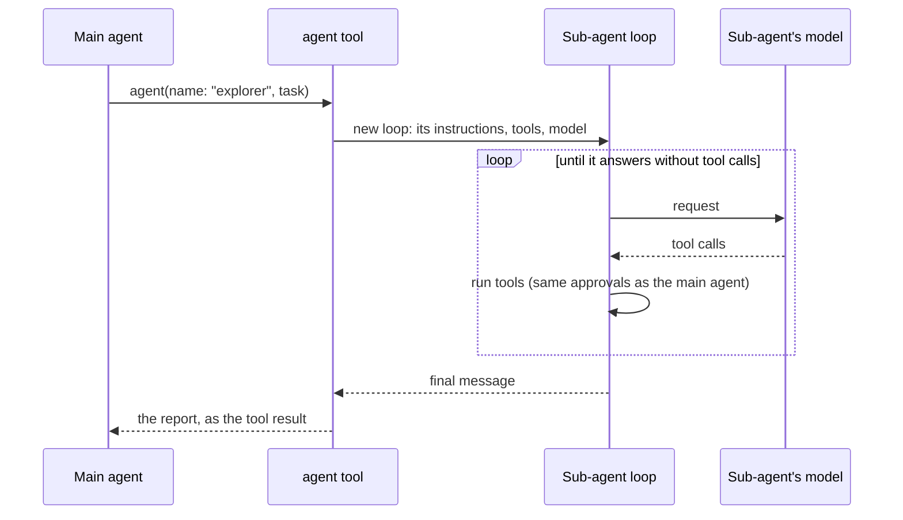

# Sub-agents

A sub-agent is a separate agent loop with its own model, instructions, and
tools. The main agent starts one with the `agent` tool, giving it a
self-contained task. The sub-agent works independently, and only its final
report returns to the main conversation, keeping that context small.

There are no built-in agents: the `agent` tool exists only when at least
one agent file is configured.



## Agent files

One Markdown file per agent, with YAML front matter:

- `~/.config/wisp/agents/*.md`: available in every project.
- `.wisp/agents/*.md`: this project only. It overrides a global agent with
  the same name.

```markdown
---
name: explorer                        # required: lowercase, digits, - or _
description: Read-only code search.   # required: tells the main agent when to delegate
model: fast-agent                     # optional, default: the main model
base_url: http://localhost:8091/v1    # optional, default: the main endpoint
api_key_env: EXPLORER_API_KEY         # optional, default: the main API key on the main host
tools: [ls, glob, grep, read]         # optional, default: every tool except agent
max_iterations: 15                    # optional, default: 100
---
You are a code search specialist. Report findings as file:line references.
```

- **The prompt.** The body is the agent's instructions, in place of wisp's
  own persona. wisp adds the rest of the system prompt: the shared tool and
  safety rules, the environment (working directory, platform, date, git
  branch), the project's `AGENTS.md`, and a note that its final message is
  its report (`prompt.BuildAgent`).
- **Validation.** Unknown front-matter fields and unknown tool names are
  startup errors.
- **API keys.** The main API key is sent only to an endpoint with the main
  endpoint's scheme and host. An agent whose `base_url` is elsewhere gets
  no key unless it sets `api_key_env`.
- **Project agents** load whether or not the project is trusted. Until it
  is, their `base_url` and `api_key_env` are ignored, and they run on the
  main endpoint (see [permissions.md](permissions.md#project-trust)).

## Running

- **No nesting.** Sub-agents cannot start other sub-agents.
- **Shared approvals.** Sub-agents share the session's approval rules: an
  "always allow" given to the main agent covers sub-agents too, and vice
  versa. Approval prompts name the sub-agent asking (`explorer ▸ bash …`).
- **Concurrency.** `--max-agents N` (default 1) limits how many run at
  once, and extra runs wait. Keep 1 for local servers that load one model
  at a time.
- **Cancelling.** Esc cancels running and waiting sub-agents with the turn.
- **Failures.** A failing sub-agent returns an error result the main agent
  can react to.
- **Context.** A sub-agent's loop knows its model's context window, output
  cap, and price: the main model's, or what its own endpoint reports,
  looked up once. So it clips large results, masks old ones, and, when the
  window is known, compacts (docs/compaction.md). A sub-agent whose model
  the endpoint says can't call tools runs without them, as the main agent
  does: it can answer from its task, but not read or run anything.
- **Saved history.** Only the `agent` call and its report are saved in the
  session; the sub-agent's own steps are not.
- **MCP.** Sub-agents share the main session's MCP connections (see
  [mcp.md](mcp.md#sub-agents)).

## TUI

- **The Agents panel** opens on the right when the first sub-agent starts.
  It shows recent runs: status, task, elapsed time, and the current step
  (or tool calls and tokens when finished).
  - `/agents` shows or hides it.
  - Side panels stack in the order Tasks, Agents, Debug.
- **In the main chat**, the `agent` box shows the sub-agent's current step
  while it runs.
- **A sub-agent's own chat.** Open it by clicking an `agent` box (or
  selecting it and pressing Ctrl+O), or a run in the Agents panel. It
  replaces the transcript with that sub-agent's task, reasoning, tool boxes,
  and report, updating live, and the chat box's top border names the agent.
  - Ctrl+B or `/back` returns to the main chat, and so does sending a
    prompt.
  - Sub-agent chats live only in memory: after `/resume`, clicking an old
    `agent` box expands its report instead.
- **Tokens.** `/debug` shows sub-agent tokens and cost on their own
  `agents` rows, separate from the main session.
