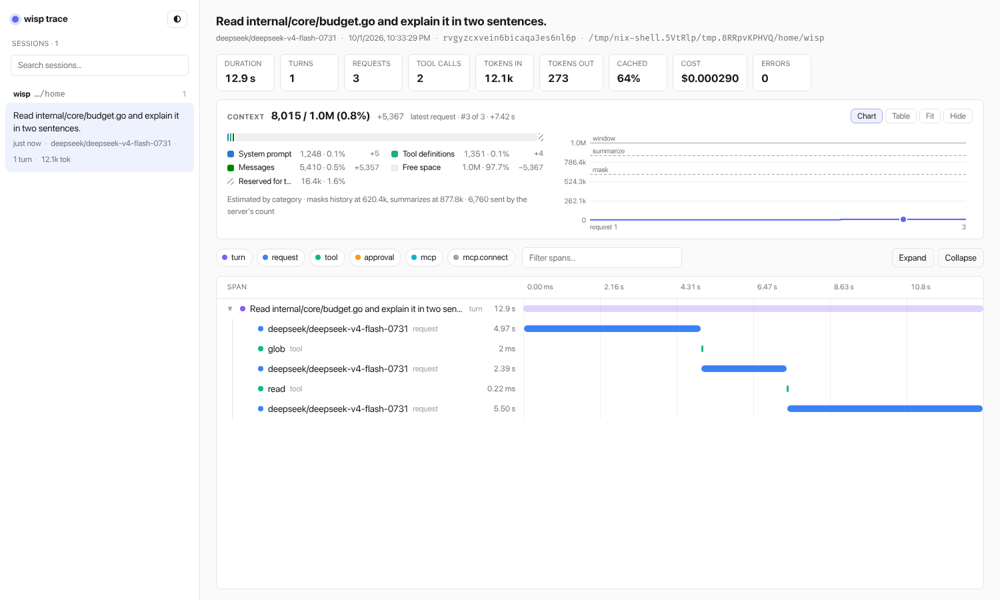
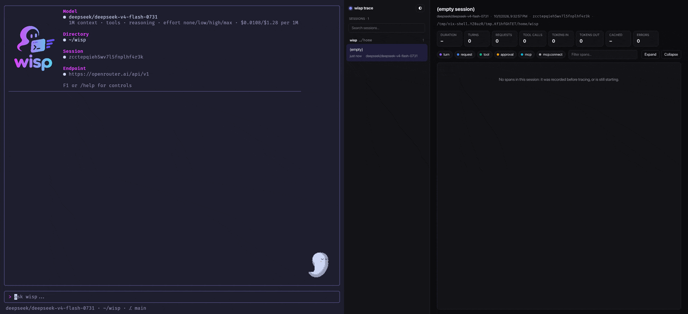

# Tracing

Every session records what it does as timed spans in the session database
([session.md](session.md)): turns, model requests, tool calls, approvals,
MCP calls, and sub-agents. `wisp --trace` serves them as live timelines in
the browser while you work, and `wisp --trace-only` browses past sessions
without a model:

```sh
wisp --trace                  # work as usual; the URL is printed on stderr
wisp --trace-only             # just the page; no model needed
wisp --trace --trace-addr 127.0.0.1:9000
```

The page lists every project's sessions, grouped by directory: the one
wisp was started in first, as "This folder", then the others, most
recently used first. It follows this folder's newest session as it runs.

<picture>
  <source media="(prefers-color-scheme: dark)" srcset="images/trace-dark.png">
  
</picture>

## Spans

A **span** is one timed piece of work with a parent, shaped like an
OpenTelemetry span: id, parent, start, end, status, attributes. Attribute
names follow OpenTelemetry's GenAI conventions where one exists
(`gen_ai.request.model`, `gen_ai.usage.input_tokens`, `gen_ai.tool.name`,
...), `wisp.*` otherwise, so an OTLP exporter could be added without
renaming anything.

### What is recorded

```
mcp.connect      each MCP server's start: server, tools, error
turn             a user message to the final answer: input, message index
├ request        one model request: model, tool choice, tools sent, messages,
│                input/output/cached tokens, cost, routing, provider, time to
│                first token, output tokens/s, truncated, reasoning, answer, calls,
│                context snapshot (wisp.context)
├ request        a summary request (wisp.compaction), named "compact"
└ tool           one tool call: name, call id, arguments, result, risky,
  │              how it was allowed; status skipped for a repeated call
  ├ approval     waiting for the user: decision, note; denied is red
  ├ mcp          the call to the MCP server behind mcp_call
  └ turn         a sub-agent's run, with its own requests and tools
```

- **Statuses:** `ok`, `error`, `denied`, `skipped`, `cancelled`, or none
  while running.
- **Size:** string attributes are cut at 256 KB.
- **Background summaries** are recorded at the top of the session, since
  they belong to no turn.

### Cost

Per request, for the main agent and sub-agents alike:

- **`wisp.usage.cost_usd`:** what the endpoint billed, when it says
  (OpenRouter does). Exact.
- **`wisp.cost.list_usd`:** the request at its model's list price
  (`wisp.price`), split into `wisp.cost.input_usd`,
  `wisp.cost.cached_input_usd`, and `wisp.cost.output_usd`, with cached
  tokens at the cached rate. Each loop prices at its own model: the main
  agent at the current model (or `--price`), a sub-agent with its own
  `model` at that model's price, looked up once from its endpoint.
- **`wisp.cost.usd`** is the billed cost when there is one, else the
  list-price one; **`wisp.cost.source`** says which (`billed`,
  `list price`, `unknown`). Session totals and the page's roll-ups use it.

### Routing

On OpenRouter, requests also record how they were routed
([model-provider.md](model-provider.md#openrouter)):

- **`wisp.routing`:** the mode: `pinned` for `--provider`, `cheapest`, or
  OpenRouter's `price sort`.
- **`wisp.routing.order`:** the providers asked, in order, and
  **`wisp.routing.rates`** each one's rates per 1M tokens.
- **`wisp.provider`:** who served the request. The page marks one served
  by a fallback.

### How it works

- **Spans travel in the `context`,** so a child finds its parent without
  being passed one. The dispatcher's tool span is the parent of whatever
  the tool does, a sub-agent's whole loop included.
- **Who opens what:** the loop opens turn and request spans (`core/trace.go`),
  `tool.Dispatch` opens tool spans, the permission gate opens approval
  spans, and MCP opens mcp spans. A call allowed by an "always" rule or by
  `--dangerously-skip-permissions` is marked on its tool span instead.
- **The loop never waits on the database.** One goroutine writes the spans.
  Each is written when it starts, so running work is visible, and again
  when it ends.
- **Storage:** a `spans` table next to `sessions` and `messages`. Spans
  duplicate some of what `messages` holds (tool results, answers), because
  sub-agent messages are not stored anywhere else.

## The page



Above, wisp works on the left while the page on the right follows its
session: the turn, each request, and each tool call appear as they start,
and the totals and context chart update. Afterwards, ↑/↓ step through the
spans, and each one's details show its tokens, timing, billed cost, and
which provider served it.

`--trace` serves the page from the same process while wisp runs, and
prints its URL on stderr (and the TUI shows it on its welcome screen). If
the port is taken, e.g. by a second wisp with `--trace`, it uses a free
one.

- **Sessions** on the left, newest first, with turns, tokens, errors, and a
  `live` badge while one is running. The list refreshes every 5 s, an open
  session's spans every 2 s.
- **Summary:** model, duration, turns, requests, tool calls, tokens in and
  out, cache hit rate, cost, errors.
- **Context,** at the top: what one request's context held, from its
  `wisp.context` snapshot.
  - The bar and legend show used against the window, by category: system
    prompt, AGENTS.md, tool definitions, MCP, summary, messages, free, and
    reserved. The mask and summarize thresholds, masking, compactions, and
    the server's count of what was sent are listed too, each with its
    change since the previous request.
  - Beside it, a step chart of each request's context, one step per
    request, so idle time doesn't squash it. It marks the thresholds,
    compactions, and where masking grew. Hover reads a request, click
    selects it.
  - **Table** lists the same numbers, **Fit** scales the chart to the usage
    rather than the whole window, and **Hide** folds the panel to its bar.
    The choices are kept in the browser.
  - With nothing selected it shows the latest request. Selecting a span
    moves it to that request, or to the last one the span's agent sent
    before the span ended. A compaction's own request is left out of the
    series; selecting it shows the context before it.
- **Timeline:** one row per span, indented under its parent, with a bar on
  the session's time axis. Toggle kinds to hide a level (its children move
  up), collapse rows with the caret, filter by name, and double-click a
  row to zoom to it.
- **Detail** (click a row, or ↑/↓, Esc to close):
  - status, start, and duration;
  - for requests: cache hit, output speed, first token, cost and its
    breakdown, routing, their context, and what came in since the agent's
    previous request;
  - for turns and tool calls: a roll-up of the requests under them, so a
    sub-agent run shows what it cost;
  - every attribute, with long values (input, reasoning, answer,
    arguments, results) as expandable blocks and JSON pretty-printed, and
    for a turn its messages from the session.
- **Links.** The URL's fragment is `#session/span`, so a view can be
  reopened.
- **Layout.** The page itself doesn't scroll: the session list, the span
  list, and the detail panel each scroll on their own. Drag the edge of
  the session list or the detail panel to resize it, or focus the edge and
  use ←/→ (double-click or Home resets). Search sessions by first prompt,
  model, or id. The page is read-only.
- **Live updates** don't lose your place: the detail panel keeps its
  scroll and open blocks, the filter keeps its focus, and the chart's
  tooltip stays under the pointer.

The page is one embedded file (`internal/traceui/index.html`): no build
step, no external scripts, and every value from a session is inserted as
text, never as HTML.

## Who can read it

The page shows whole sessions, tool output included, so it answers only
you:

- **A secret path.** Everything is served under a random path, generated
  fresh each run: `http://127.0.0.1:7777/<secret>/`. Only the URL wisp
  prints works; anything else is not found. Listening on localhost alone
  isn't enough, since every user of the machine can reach it.
- **This machine only.** Only connections from a loopback address are
  answered, even when `--trace-addr` listens on another interface such as
  `0.0.0.0`.
- **No other sites.** Only requests addressed to localhost (`Host`) are
  answered, and, when a browser says where a request comes from
  (`Origin`), only the page's own. Through DNS rebinding a website's name
  can resolve to 127.0.0.1; these checks keep its pages out.
- **Headers.** Responses carry `X-Content-Type-Options: nosniff` and
  `Referrer-Policy: no-referrer`, so the secret path never leaves in a
  `Referer`. API responses carry `Cache-Control: no-store`.

`/api/sessions` computes span totals only for the sessions it lists, so
polling doesn't read the rest of the database.
