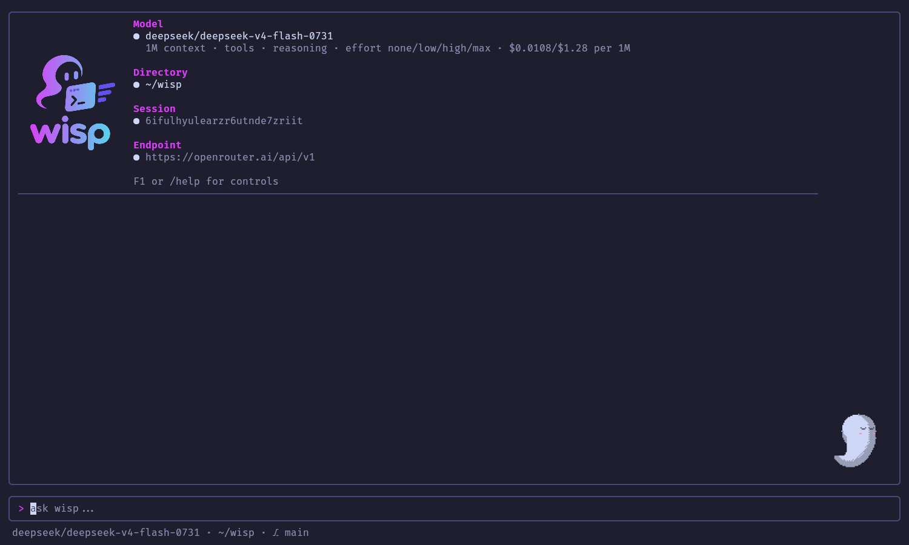
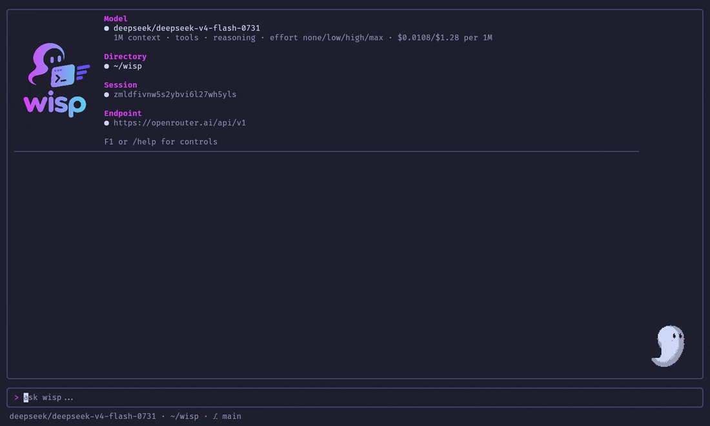

# Using wisp

Run wisp from the directory you want to work in. Without a prompt it opens
the terminal UI; with one, it runs a single turn and exits. With no prompt
and no terminal on stdin and stdout, as in a pipe or a script, it exits with
an error instead of starting a UI it can't draw.

```sh
wisp                                 # the TUI
wisp "Explain this repository"       # one turn, printed to stdout
wisp --resume 3f2a                   # continue a session (an id prefix works in the TUI)
```

## The TUI



The splash shows the model, directory, session, and endpoint. Type a prompt
and press Enter. The answer streams in; reasoning, when the model shows it,
appears in a dimmed box above it, and each tool call gets a card that fills
in as it finishes. The composer stays editable while the model works, so
you can write the next message.


Each tool call is a card: a spinner while it runs, then ✓ or ✗ with a
one-line summary, such as the lines read or a command's exit status.
Reads and searches run at the same time; a write or a command waits for
the calls before it. Alt+Left selects a card, and Ctrl+O opens its full
output.

When the model plans with the todo tool, the task panel shows the plan and
ticks steps off as they're done; `/todo` shows or hides it.


### Keys

| Key | Action |
| --- | --- |
| Enter | Send; while the model works, keep the draft |
| Alt+Enter or Ctrl+J | New line |
| Up / Down | Recall sent prompts (inside a multi-line draft, move first) |
| Esc or Ctrl+C | Cancel the running turn |
| Esc (idle) | Close help or a list, leave a sub-agent chat, clear the selection |
| Ctrl+C (idle) | Clear the input; twice to exit |
| PgUp / PgDown, Ctrl+U / Ctrl+D, wheel | Scroll |
| Ctrl+End | Jump to the latest output and follow it |
| Alt+Left / Alt+Right | Select the previous / next block |
| Ctrl+O | Expand or collapse the selected tool output or reasoning; on an `agent` box, open the sub-agent's chat |
| Ctrl+Y | Copy the selected block, full tool output included, without control characters |
| Ctrl+R | Toggle the latest reasoning |
| → (empty input) | Accept the suggested next message (`--suggest`) |
| Ctrl+B | Back from a sub-agent chat |
| F1 | Help |

The mouse works too: hover shows what a click hits, clicking a tool or
reasoning box expands it, and dragging copies text. Some terminals don't
send Alt+Enter; Ctrl+J always works.

### Commands


| Command | Action |
| --- | --- |
| `/help` | Keys and commands |
| `/model`, `/model NAME` | Pick a model from the endpoint's list, with context and capabilities, or switch |
| `/effort`, `/effort LEVEL` | Pick the model's reasoning effort, or set it; `default` leaves it to the model, `none` turns reasoning off |
| `/sessions`, `/resume`, `/resume ID` | List this directory's sessions, or switch to one while idle |
| `/clear` | Start a new session; the current one stays saved |
| `/undo` | Take back the last turn: files `write`, `edit`, and `multi_edit` changed are restored, its messages are dropped, and its prompt returns to the input box. Changes made by `bash` or MCP tools stay, and are named; turns before the latest compaction can't be undone |
| `/session-rename NAME` | Name the current session; lists show the name in place of its first prompt |
| `/context` | What fills the context window, by category |
| `/compact [focus]` | Summarize the conversation now, optionally saying what to keep |
| `/debug` | Token usage, timing, cost, and the context budget |
| `/todo`, `/agents` | Show or hide the task list and the sub-agent panel |
| `/back` | Back from a sub-agent chat |

Typing `/` lists the commands, and after `/model`, `/effort`, or `/resume` their
choices: type to filter, ↑/↓ to choose, Tab to complete, Enter to run.
`/model` shows what the endpoint reports about each model: its context
window, tools, vision, reasoning effort levels, and price.

On a narrow terminal, `/debug` replaces the transcript; `/debug` again
returns to it. The smallest usable size is 20 × 8.

### Reasoning effort


`/effort` sets how hard a reasoning model thinks before it answers.
`default` leaves it to the model, `none` turns reasoning off, and the
levels in between trade speed and cost for depth. The level shows next to
the model in the status line, and `--effort LEVEL` (or `$WISP_EFFORT`)
sets it at startup.

The list offers only the levels the model takes, as the endpoint reports
them: OpenRouter lists each model's levels, and a llama.cpp chat template
says whether it takes an effort or can turn thinking off. A local model is
asked once it has loaded, so before its first turn `/effort` lists only
`default`. Switching to a model that doesn't take the current level goes
back to its default, and says so. Ctrl+R opens the latest reasoning.

### Context and cost


`/context` shows what fills the context window, by category, and where
masking and summarizing would start. `/debug` adds tokens, timing, and
cost per request, with the provider that served it on OpenRouter, where
`--cheapest` sends requests to the two cheapest providers that keep no
data. `/compact` summarizes the conversation on request
([compaction.md](compaction.md)). Cost is the billed amount when the
endpoint reports it, else an estimate from the model's price
([config.md](config.md#cost)).

## Approvals



Reading and searching run without asking. Writing files, editing, running
commands, fetching URLs, and MCP tools that aren't read-only ask first.
The prompt shows the command and its directory, the proposed edit as a
diff, or the new file's content:

| Key | Answer |
| --- | --- |
| `y` | Allow this call |
| `a` | Always allow calls like it, for the rest of the session |
| `n` | Deny |
| `t` | Deny with a note that tells the model what to do instead |
| Esc | Cancel the whole turn |

- **"Calls like it"** depends on the tool: `git status` covers `git
  status` commands but not `git push`, `fetch` covers the host, and edits
  cover the working directory. [permissions.md](permissions.md) has the
  details.
- **The chat stays scrollable.** While a request waits, ↑/↓ and the wheel
  over the prompt scroll its details; PgUp/PgDown and the wheel over the
  chat scroll the chat, and Ctrl+End jumps to the latest output.
- **Keys count only after a pause.** An answer key counts once the prompt
  has been visible and you have paused typing for 0.4 s, so a prompt that
  appears mid-sentence can't take a letter as an answer.
- **Approval isn't a sandbox:** tools run with your account's access.

## Notifications

Look away during a long turn and wisp can call you back:

```sh
wisp --notify desktop   # or: export WISP_NOTIFY=desktop
```

- **When.** An approval starts waiting (a sub-agent's too), a turn of 10 s
  or more ends, or a turn fails. Not after a short turn, when you are most
  likely still watching, and not when you cancel one.
- **Only when you look elsewhere.** wisp asks the terminal to report focus,
  and stays quiet while it has it. A terminal that never reports focus
  counts as unfocused, so it always notifies.
- **How.** `desktop` shows a desktop notification through `notify-send`
  (from libnotify; `libnotify-bin` on Debian and Ubuntu), with wisp's icon
  (written to `~/.cache/wisp/notify-icon.png`), naming the project
  directory, so several wisps can be told apart. The text is sent as plain
  text. Without
  `notify-send`, or on a system other than Linux, it rings the bell
  instead. `bell` only rings the terminal bell, which most terminals turn
  into a sound, a flash, or an urgency hint on the window. `off`, the
  default, does neither.
- **The TUI only.** One-shot mode never notifies: whatever runs it is
  waiting on it already.

## One-shot mode

```sh
wisp "Add a test for parsePrice"
wisp --model qwen3-coder "Explain this repository"
```

- **Output.** The answer, dimmed reasoning, and tool calls print as plain
  text as they stream, with escape sequences stripped. On stderr, the
  session id is printed when the run starts, and a usage summary
  (requests, tokens, cache hits, cost) when it ends.
- **Approvals** are asked on the terminal: `[y] allow  [a] always allow ...
  [N] deny`. `--dangerously-skip-permissions` runs without asking, for
  scripts and benchmarks in a sandbox.
- **Exit status.** Interrupted with Ctrl+C, wisp exits with status 130; a
  failed turn exits with 1.
- **No model given?** wisp picks the one last used with the endpoint, or
  its only model. When several remain, it lists them and exits.

## Sessions

Every conversation is saved in `~/.local/share/wisp/session.db`, tagged
with the working directory: messages, tool calls and results,
compactions, and trace spans.

- **Listing and resuming.** `wisp --sessions` or `/sessions` lists recent
  sessions, and `--resume ID` or `/resume` continues one, with its model.
- **Repairs.** A turn interrupted by Esc or a crash is repaired on resume,
  so strict endpoints accept the history.
- **Sharing.** Several wisp processes can share a directory.
- **Not saved:** reasoning and images.

See [session.md](session.md) for the schema and [tracing.md](tracing.md)
for browsing sessions as timelines.

## Long conversations

When the context window fills up, wisp first replaces old tool output with
short stand-ins that say how to get it back, and, if that isn't enough,
summarizes the older part of the conversation while keeping the recent part
verbatim. With a local model the summary is prepared between turns, so it
costs no wait. A notice in the transcript marks each compaction and expands
to show the summary. See [compaction.md](compaction.md).
